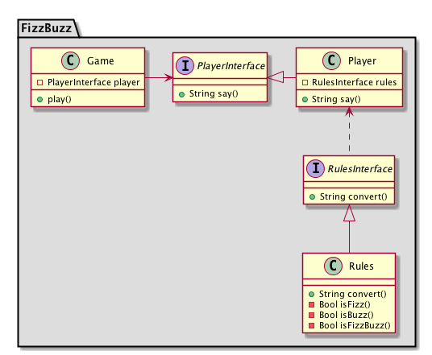

## Overview
- PHPでFizzBuzzを実装したもの
- php-diを動かすための確認用なので、設計はイマイチ
- PHP7.0で実行可

## Installation

```
$ git clone git@github.com:masa0221/fizzbuzz-php.git && cd fizzbuzz-php
$ composer install
```

## Usage

```
$ php index.php
```

## UML



Written by PlantUML